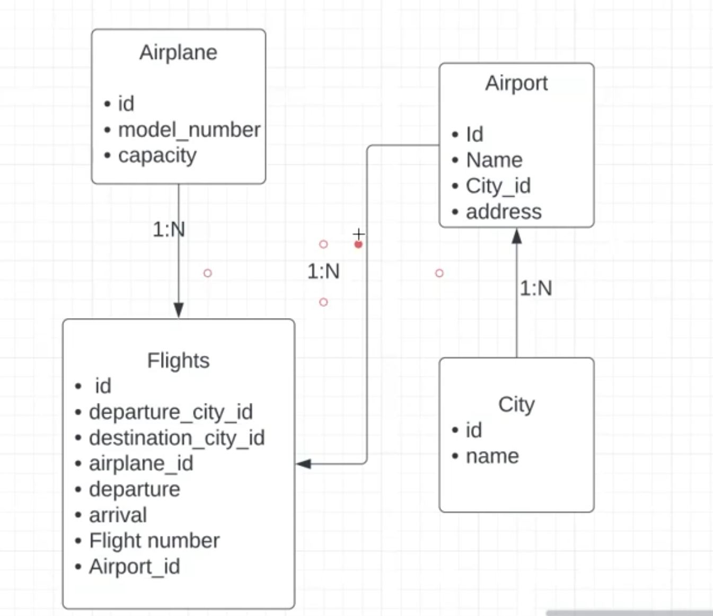

# Welcome to the Airline service

**Design service**
> 

> - create repository
> - for creating microservices
  > - create a folder `flightandsearch`
> - in the folder flightsandserach do `npm init`
> - then `npm i express`
> - then `npm i body-parser`
> - then `npm i nodemon`

**folder structure**
- src/
   - index.js/
   - models/
   - controllers/
   - middlewares/
   - services/
   - utils/
   - config/
   - repository/
- tests/

> - creating `.gitignore` file inside flightsandsearch
> - adding node_modules/ in the gitignore
> - set the path to the flightsandserach folder
> - do `git init`
> - do `git status`
> - do `git add .`
> - do `git commit -m "first commit to setup the project"`
**created a repository in github**
> - do `git branch -M main` 
> - do `git remote add origin https://github.com/saurabhsingh720/FlightAndSearchService.git`
> - do `git push -u origin main`
> - then all the folders is pushed to that repo in github

> - install `npm i dotenv` in the root directory for making the key secure in a file
> - create a file named with `.env` in the root directory
> - for getting access to the file use `require('dotenv').config()` inside the root directory js file
> - for accessing the env variable use `process.env.nameofvar`   example  process.env.PORT

**install inside flightsandserach folder path**
> - install `npm i mysql2`
> - install `npm i sequelize`
> - install `npm i sequelize-cli`

**for setting up databases** 
- do `npx sequelize init` in the flightsandserach folder path
- now some files get created
- add all files inside src folder
- go to config.json file and add password of databases and name of database
- then do `npx sequelize db:create` in the src path folder
- now databases get created

**For pushing files using command**
  - `git status`
  - `git add .`
  - `git commit -m "comments"`
  - `git push origin main`

**Design table of database**
 > 

  **For creating tables for city (model) and attribute name**
   - `npx sequelize model:generate --name City --attributes name:String`
   - now after checking `show tables;` we can not find any tables
   - so to link it use `npx sequelize db:migrate`
   - if you want to change something in the city or migration file firstly do `npx sequelize db:migrate:undo`
   - then after changing do `>npx sequelize db:migrate`
   

**City-repository**
 - Completed all the CRUD function in city repository
 - completed index.js file in it.
   
**Services**
 - Completed `city-service` file
 - completed index.js in it.

**Routes**
 - Setting routes 
 - created index.js file and v1 folder
 - inside `v1` folder created index.js file that contains all req `get`, `post`, `patch`, `delete`.
 - added `getAll` city apis.
 - Added `filter` to getAll cities.

 > - `till now we created city table'
 > - `city -> id, name, created_at, updated_at`

## Now creating Airport table(model)
 - `Airport -> id, name, address, city_id, created_at, updated_at` 
 - Go to the src path.
 - do `npx sequelize model:generate --name Airport --attributes name:String,        address:String,cityId:integer` for creating airport table.
 - now do some changes in association 
 - now do `npx sequelize db:migrate`
 - now airport tables get finally created.
 - For generating initial values to `seeder file` use `npx sequelize seed:generate --name add-airports`
 - add all the airports in the seed file
 - then do `npx sequelize db:seed:all`
 - then do for checking in databases `select * from Airports Join Cities on Airports.cityId = Cities.id where Cities.id = 10;`

## Now creating a Airplane table(model)
 - do `npx sequelize model:generate --name Airplane --attributes modelNumber:String,capacity:integer`
 - now do `npx sequelize db:migrate`
 - now adding seeder file do `npx sequelize seed:generate --name add-airplanes`
 - now do `npx sequelize db:seed:all`

 ## Now creating a Flight table(model)
 - do `npx sequelize model:generate --name Flights --attributes flightNumber:String, airplaneId:integer,departureAirportId:integer,arrivalAirportId:integer,arrivalTime:Date,departureTime:Date,price:integer,boardingGate:String,totalSeats:integer` 
 - do `npx sequelize db:migrate`
 - completed all the create, get, and getall flights function
 - applied filters on the flights
 - till now all the flights is handle using postman at path `localhost:3000/api/v1/flights`

- **Now crud repository is setuped**
- **Then Airport table(model) is   created**
- settuped all airport services, repository, controllers
- for airports we use  `localhost:3000/api/v1/airports` path in postman